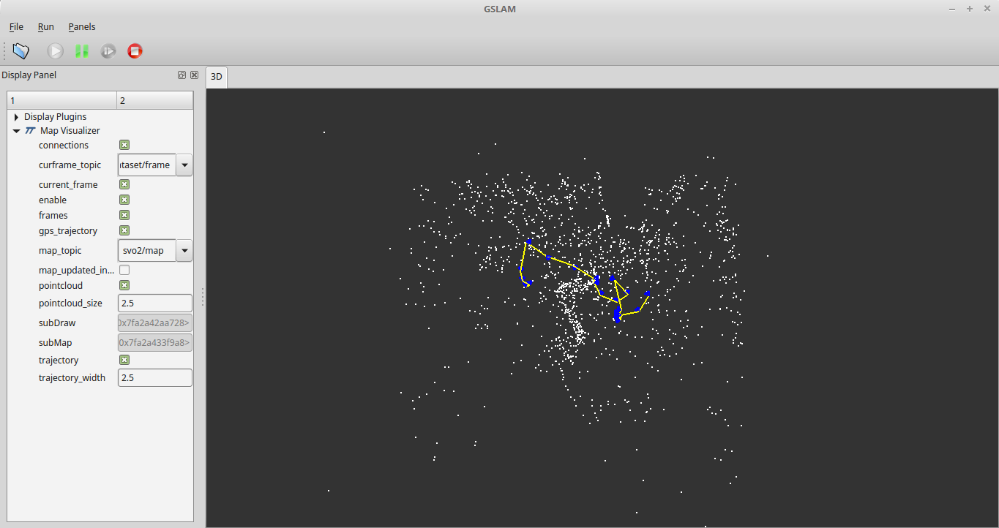

# GSLAM-SVO2

## 1. Introduction

This code is the [SVO2](https://github.com/uzh-rpg/rpg_svo_example) plugin implementation base on [GSLAM](https://github.com/zdzhaoyong/GSLAM).



## 2. Build and Install
### 2.1. Build and Install GSLAM

```
git clone https://github.com/zdzhaoyong/GSLAM
```

Install GSLAM following documentation.

**WARNING: Since SVO2 use OpenCV 3.3, please compile GSLAM with the same version!**

### 2.2. Build and Install gslam_svo2

```
mkdir build;
cd build;
cmake ..;
make;
sudo make install
```

## 3. Run gslam_svo2 with gslam

```
gslam qviz svo2 play -dataset /data/zhaoyong/Dataset/mav0/.euroc -autostart
```
